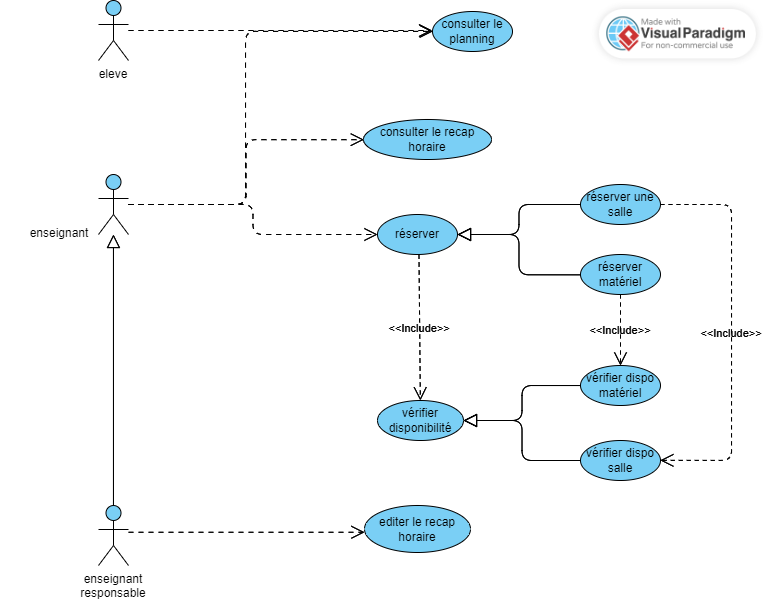

# Gestion des Réservations et Planification Scolaire

# Description
Ce projet permet de gérer la réservation de salles de cours et de matériel pédagogique (ordinateurs portables, vidéoprojecteurs) au sein d'un établissement scolaire. Il vise à faciliter l'organisation des cours et des ressources en assurant une gestion centralisée et sécurisée des réservations.

# Fonctionnalités principales :

- Réservation de salles et de matériel : Les enseignants peuvent réserver des salles de cours et du matériel pédagogique en fonction de leur disponibilité.
- Consultation des plannings : Tous les utilisateurs (enseignants et étudiants) peuvent consulter les plannings des salles pour connaître leur occupation.
- Accès au récapitulatif horaire : Les enseignants peuvent consulter un récapitulatif horaire des formations dont ils sont responsables.
- Gestion des récapitulatifs : Un enseignant responsable a la possibilité d'éditer le récapitulatif horaire de sa formation.

# Objectif du projet :
Modéliser cette gestion de réservations et de plannings via un diagramme de cas d'utilisation UML, permettant de clarifier les interactions entre les différents utilisateurs (enseignants, étudiants, enseignants responsables) et le système de réservation.

# Diagramme de cas d'utilisation

